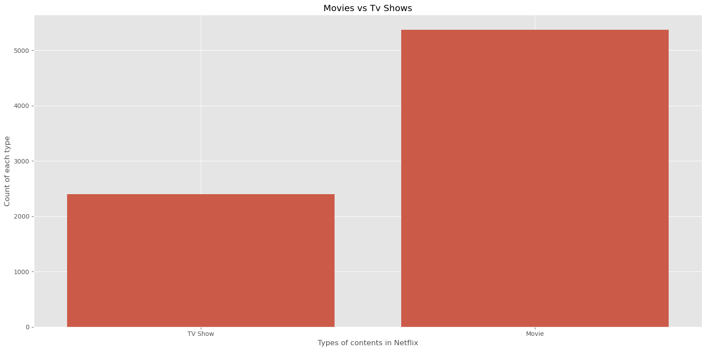
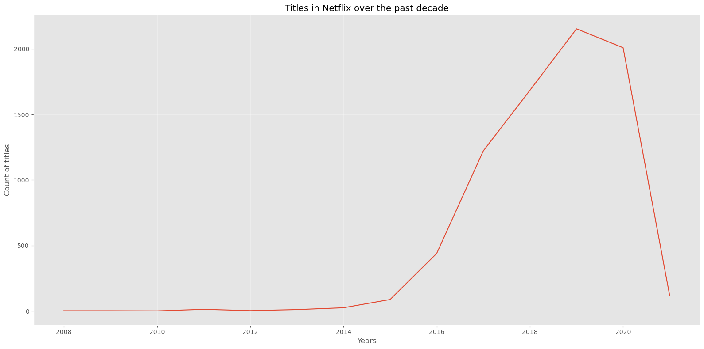
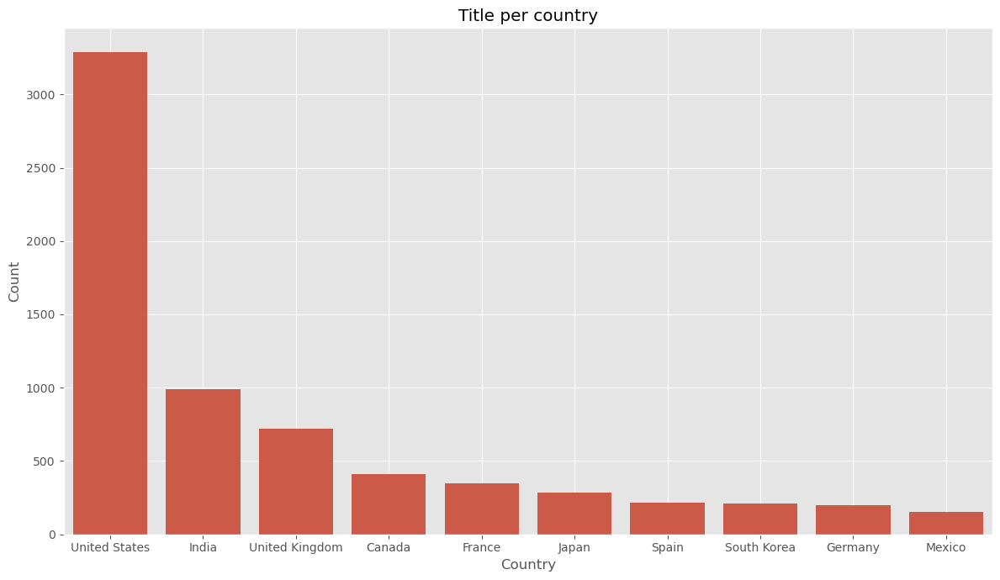
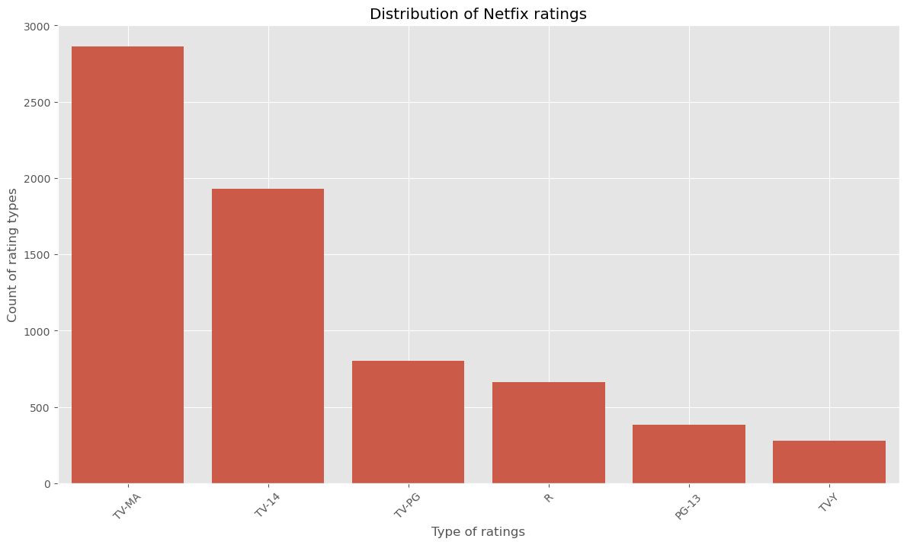

# 🎬 Netflix Titles Analysis Project

## 📌 Overview
This project analyzes Netflix titles data to uncover trends, content distribution, release patterns, and key business insights using Python.

---

## 🛠️ Tools & Libraries
- Python
- Pandas
- Matplotlib
- Seaborn
- Jupyter Notebook

---

## 📂 Dataset Description

The dataset used in this project contains **7,787 Netflix titles** with **12 columns**, including both Movies and TV Shows. It provides information such as title name, content type, country, release year, rating, duration, genre, and date added to Netflix.

---

## 📂 Project Structure
- data/ → Raw dataset (CSV)
- notebooks/ → Analysis notebook
- images/ → Visualizations
- README.md
- requirements.txt

---

## 📊 Key Analysis Performed
- Movies vs TV Shows distribution
- Content release trends over the years
- Top countries producing Netflix content
- Ratings category analysis
- Duration analysis of movies
- Genre/category exploration

---

## 🔍 Key Insights
- Movies dominate Netflix's content library.
- Significant growth in content was observed after 2015.
- A few countries contribute most of the catalog.
- Mature audience ratings appear frequently.
- Movie durations are concentrated in common runtime ranges.

---

## 📈 Recommendations
- Increase investment in top-performing countries
- Expand TV Shows library
- Focus on popular genres
- Maintain balanced audience ratings

---

## 📸 Sample Visualizations

### 1. Movies vs TV Shows

➡️ Insight: Movies are dominating over Netflix.

### 2. Year-wise content growth

➡️ Insight: The highest number of titles were added around 2019.

### 3. Top contries to make Netflix content

➡️ Insight: The United States is the largest contributor to Netflix’s content library.

### 4. Top ratings

➡️ Insight: TV-MA, TV-14, and TV-PG ratings dominating the platform’s catalog.

---

## 🚀 How to Run

1. Clone this repository

2. Install dependencies:

pip install -r requirements.txt

3. Open the notebook and run all cells.

---

## 👨‍💻 Author
Abhinibesh Mal
